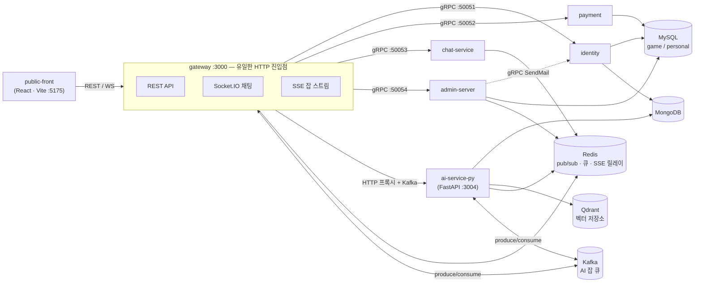
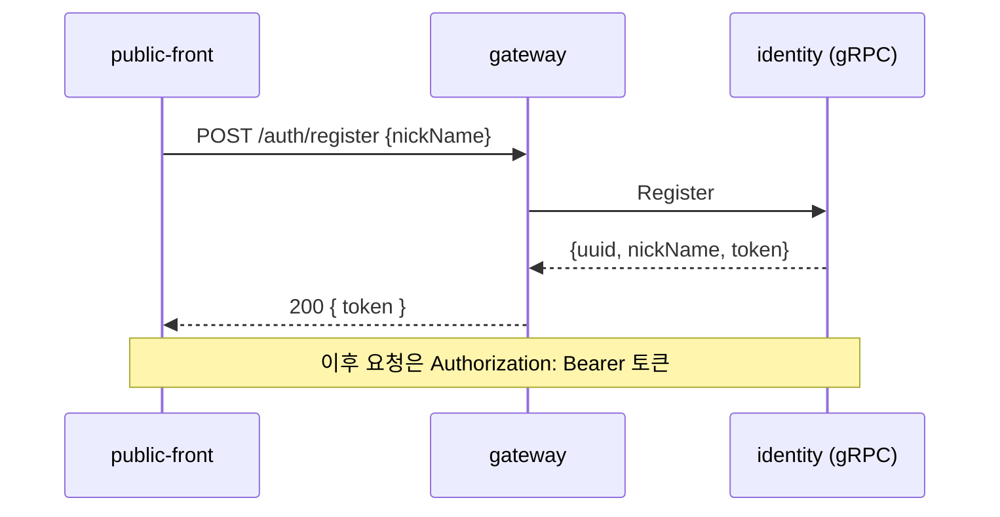
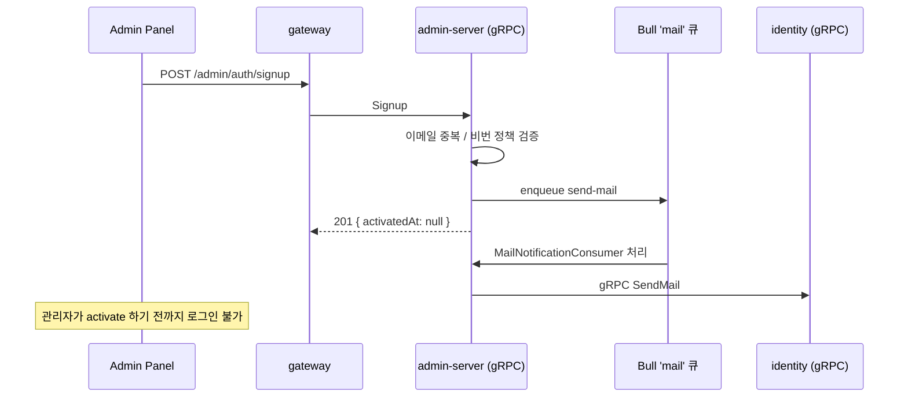
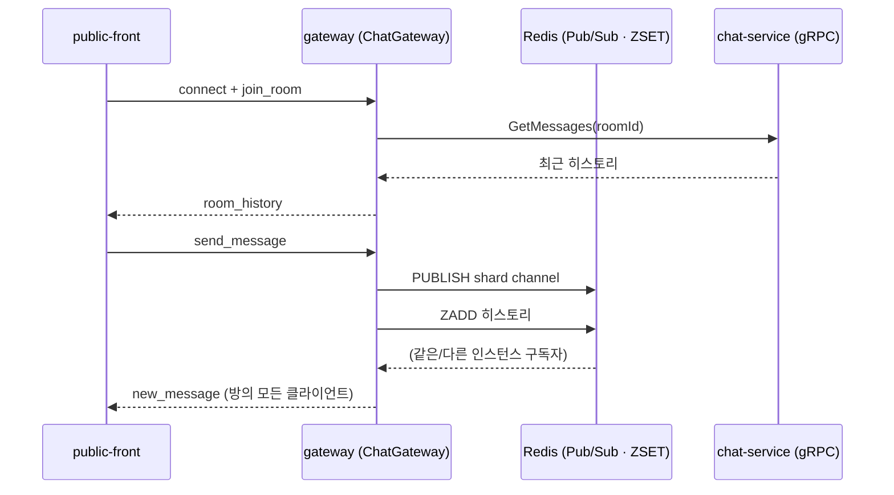
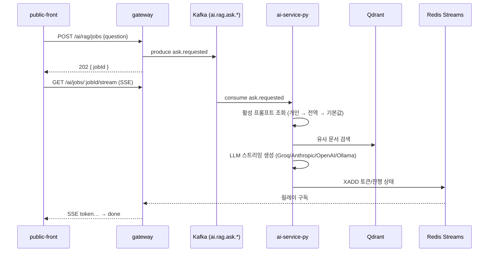
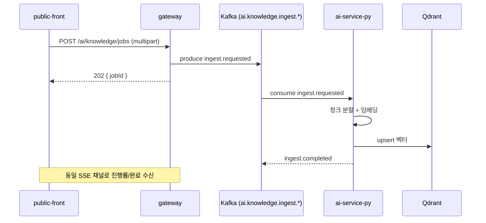

# public-project — 시스템 스펙

웹 프론트엔드(`public-front`) · gRPC 마이크로서비스 메시(`public-server`) · RAG/AI 서비스(`public-python-server`)로
구성된 3-레포 시스템의 현재 구조를 정리한 문서입니다. `gateway`를 유일한 HTTP 진입점으로 두고,
내부 서비스는 전부 gRPC 또는 Kafka로만 통신합니다.

| | |
|---|---|
| HTTP 진입점 | `gateway` 1개 (`:3000`) |
| gRPC 백엔드 | 4개 (identity · payment · chat-service · admin-server) |
| Kafka 비동기 잡 | 2개 (RAG 질의응답 · 문서 인제스트) |
| 저장소 | MySQL · Redis · MongoDB · Kafka · Qdrant |

> 아래 내용은 작성 시점 기준 스냅샷입니다. 코드가 바뀌면 이 문서도 함께 갱신해야 합니다.

## 목차

- [전체 토폴로지](#전체-토폴로지)
- [요청 흐름](#요청-흐름)
  - [유저 / 관리자 인증](#유저--관리자-인증)
  - [실시간 채팅](#실시간-채팅)
  - [RAG 질의응답 (비동기 잡 + SSE)](#rag-질의응답-비동기-잡--sse)
  - [문서 업로드 · 인제스트](#문서-업로드--인제스트)
  - [개인화 시스템 프롬프트](#개인화-시스템-프롬프트)
- [서비스 레퍼런스](#서비스-레퍼런스)
- [인프라 레퍼런스](#인프라-레퍼런스)

## 전체 토폴로지

모든 외부 요청은 `gateway` 하나로만 들어옵니다. 다른 백엔드 서비스는 포트를 열어도 docker 네트워크
내부에서만 gRPC로 호출되며, 프론트엔드나 외부에서 직접 닿지 않습니다.



- **gateway는 상태를 갖지 않는 프록시 + 실시간 릴레이 계층.** gRPC 클라이언트, Kafka 프로듀서,
  Socket.IO 서버, SSE 릴레이를 모두 gateway 프로세스 안에서 처리합니다.
- **ai-service-py만 유일하게 HTTP로 직접 프록시됩니다.** 나머지 백엔드는 gRPC 전용 — REST 응답 모양
  (camelCase, int64 문자열 등)은 gateway가 경계에서 정규화합니다.
- `admin-server`는 identity를 gRPC로 호출하는 유일한 *백엔드 간* 호출입니다 — 회원가입 메일 발송 목적.

## 요청 흐름

### 유저 / 관리자 인증

같은 `gateway`지만 게임 유저(`/auth/*`)와 관리자(`/admin/auth/*`)는 경로와 백엔드 서비스가 완전히
분리되어 있습니다. 관리자 회원가입은 승인 대기 상태로 시작하고, 비동기 메일 발송이 뒤따릅니다.





- 신규 관리자는 `activatedAt: null`로 생성되어, 다른 관리자가 `PUT /admin/user/activate`로 승인하기
  전까지 로그인이 거부됩니다.
- gRPC 실패는 `RpcErrorFilter`(admin-server, 전역 적용)가 로그로 남기고, gateway의
  `GrpcExceptionFilter`가 raw grpc-js 에러까지 잡아 실제 메시지를 HTTP 응답으로 전달합니다.

### 실시간 채팅

채팅 로직의 실시간 릴레이는 `gateway`의 Socket.IO 게이트웨이가 담당합니다. gateway가 여러
인스턴스로 뜰 경우를 대비해 브로드캐스트는 Redis Pub/Sub(샤딩)로 나가고, 히스토리는 Redis ZSET에
별도 보관됩니다.



- 실제 브로드캐스트·히스토리 로직은 `libs/rpc/chat-realtime`(샤딩 pub/sub, ZSET 리포지토리)에 있고
  gateway가 이를 가져다 씁니다.
- `chat-service`는 순수 gRPC 백엔드로만 남아 방/메시지 도메인 데이터를 제공하고, 소켓 연결은 전혀
  갖지 않습니다.

### RAG 질의응답 (비동기 잡 + SSE)

질문 하나가 곧바로 응답을 기다리는 동기 호출이 아니라, Kafka 잡으로 발행되고 결과는 SSE로
스트리밍됩니다. 이 구조 덕분에 gateway는 LLM 응답 시간과 무관하게 가볍게 유지됩니다.



- SSE는 `Last-Event-ID` 재생을 지원해 — 연결이 끊겼다 다시 붙어도 놓친 이벤트부터 이어받습니다.
- 일반 `ask_use_case`와 비판·보완 루프를 도는 `agentic_ask_use_case` 두 경로가 있고, 프론트는 진행
  단계(검색 중 → 생성 중 → 검토 중 → 보완 중)를 `AgentProgress`로 받아 표시합니다.
- 취소는 `DELETE /ai/jobs/:jobId` → Redis 취소 플래그를 스트리밍 루프가 감지해 조기 종료.

### 문서 업로드 · 인제스트

지식베이스 문서 업로드도 같은 Kafka 잡 패턴을 재사용합니다 — 업로드 자체는 즉시 응답하고,
청크화·임베딩·색인은 백그라운드에서 진행됩니다.



- 임베딩 프로바이더는 스왑 가능 — 로컬은 `Ollama(qwen3-embedding)`, 메모리 제약 없는 환경에선
  `Google gemini-embedding-001`로 전환 (환경변수 한 줄).
- Qdrant 컬렉션 벡터 차원은 `EMBEDDING_DIMENSION`과 반드시 일치해야 함 — 프로바이더를 바꾸면
  재색인 필요.

### 개인화 시스템 프롬프트

RAG 답변에 쓰이는 시스템 프롬프트는 3단계로 해석됩니다: **내 개인 설정 → 관리자 전역 기본값 →
하드코딩된 최후 기본값.** userId는 클라이언트가 아니라 gateway가 인증된 세션에서 직접 채웁니다.

```mermaid
sequenceDiagram
  participant FE as AI 설정 UI
  participant GW as gateway
  participant AI as ai-service-py
  participant M as MongoDB

  FE->>GW: POST /ai/my-prompt {content}
  Note over GW: userId = 세션.uuid (클라이언트 입력 아님)
  GW->>AI: POST /prompts {name, content, userId}
  GW->>AI: PATCH /prompts/:name/:v/activate?userId=…
  AI->>M: 해당 유저 소유 버전만 활성화
  AI-->>GW
  GW-->>FE: 저장 즉시 반영

  FE->>GW: GET /ai/my-prompt
  GW->>AI: GET /prompts/:name/active?userId=…
  AI->>M: find_active_for_user → 없으면 find_active(전역) → 없으면 기본값
  AI-->>GW
  GW-->>FE: 현재 적용 중인 프롬프트
```

> **격리 보장:** 유저 소유가 아닌 버전은 활성화할 수 없고, 관리자의 전역 프롬프트 활성화는 개인
> 오버라이드를 건드리지 않습니다 (반대도 마찬가지). 이 구현 중 발견된 실제 버그 — 전역 기본값
> 조회가 소유자 구분 없이 아무 활성 프롬프트나 반환해 다른 유저의 개인 프롬프트가 노출되던 문제 —
> 는 조회 쿼리에 소유자 스코프를 명시하는 방식으로 수정했습니다.

## 서비스 레퍼런스

gateway를 제외한 모든 서비스는 docker 네트워크 내부에서만 접근 가능합니다.

| 서비스 | 역할 | 인터페이스 | 저장소 |
|---|---|---|---|
| **gateway**<br><sub>`apps/gateway`</sub> | 유일한 HTTP 진입점. REST 프록시 + Socket.IO 채팅 + SSE 잡 스트림 + Kafka 프로듀서. | HTTP `:3000` | Redis, MySQL(personal) |
| **identity**<br><sub>`apps/identity`</sub> | 게임 유저 인증(uuid 기반 register/login), 계정 조회, 메일 발송(SendMail). | gRPC `:50051` | MySQL(game/personal), MongoDB |
| **payment**<br><sub>`apps/payment`</sub> | 결제 생성·조회. | gRPC `:50052` | MySQL(payment) |
| **chat-service**<br><sub>`apps/chat-service`</sub> | 채팅방·메시지 도메인 데이터 제공. 실시간 릴레이는 담당하지 않음(gateway 소유). | gRPC `:50053` | Redis |
| **admin-server**<br><sub>`apps/admin-server`</sub> | 관리자 인증·회원가입·유저 관리, 가입 메일 큐 컨슈머. | gRPC `:50054` | MySQL(personal), Redis(Bull) |
| **ai-service-py**<br><sub>`public-python-server`</sub> | RAG 질의응답, 지식베이스 인제스트, 프롬프트 관리, LLM 게이트웨이·관측성. Clean Architecture(도메인/애플리케이션/인프라/프레젠테이션). | HTTP `:3004` + Kafka consumer | MongoDB, Qdrant, Redis |
| **frontend**<br><sub>`public-front`</sub> | 웹 프론트엔드 + Admin Panel(모드 전환). React + Vite. | HTTP `:5175` | — |

## 인프라 레퍼런스

| 컴포넌트 | 용도 | 사용 서비스 |
|---|---|---|
| **MySQL 8**<br><sub>`db`</sub> | 논리 DB 3개 — `game` / `personal` / `payment`. | identity, admin-server, payment |
| **Redis**<br><sub>`redis`</sub> | 채팅 Pub/Sub·ZSET 히스토리, Bull 메일 큐, SSE 릴레이 스트림. | gateway, chat-service, admin-server, ai-service-py |
| **MongoDB**<br><sub>`mongo`</sub> | identity 부가 데이터, ai_service DB(프롬프트, 대화 세션, 문서 메타데이터). | identity, ai-service-py |
| **Kafka**<br><sub>`kafka`</sub> | RAG 질의(`ai.rag.ask.*`) · 인제스트(`ai.knowledge.ingest.*`) 비동기 잡 큐. | gateway (produce), ai-service-py (consume) |
| **Qdrant**<br><sub>`qdrant`</sub> | 지식베이스 문서 임베딩 벡터 저장 · 유사도 검색. | ai-service-py |
